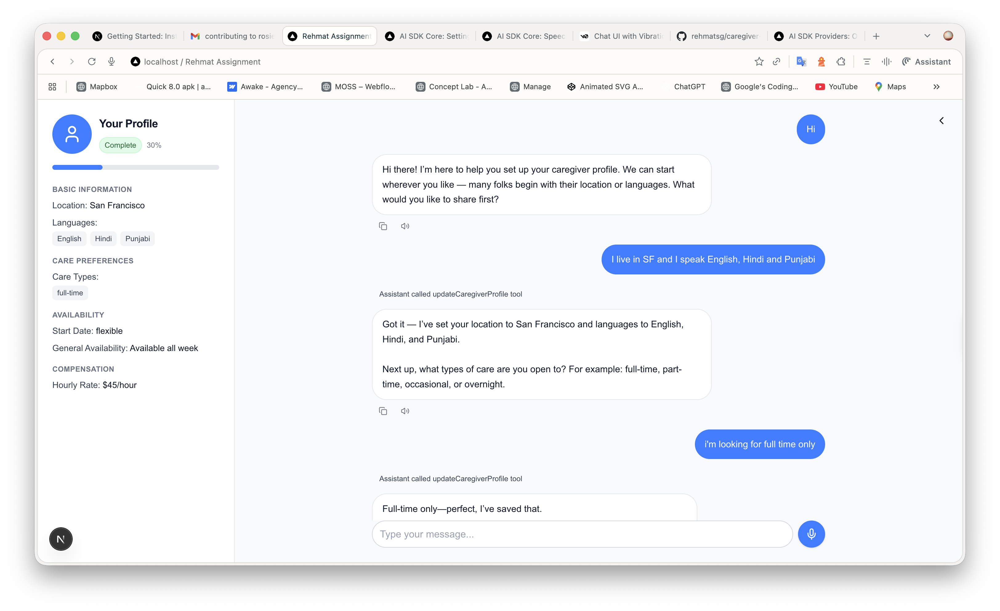
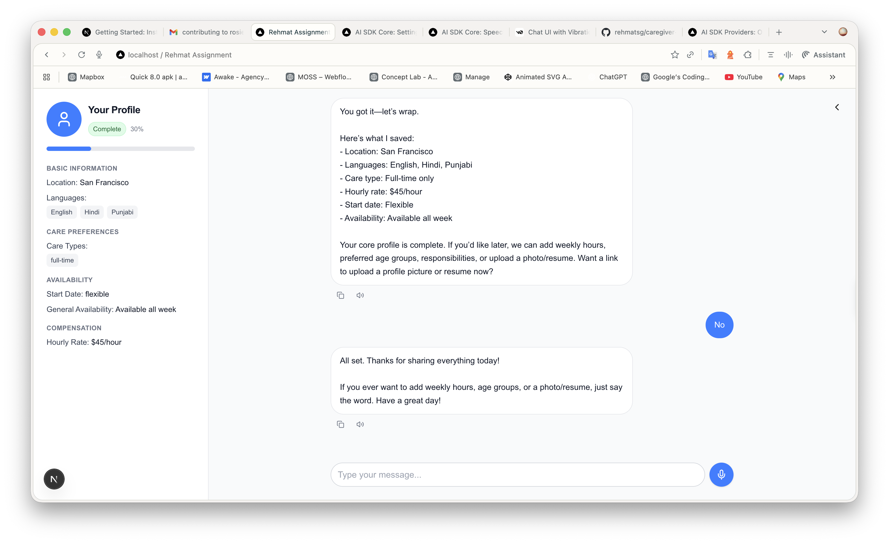
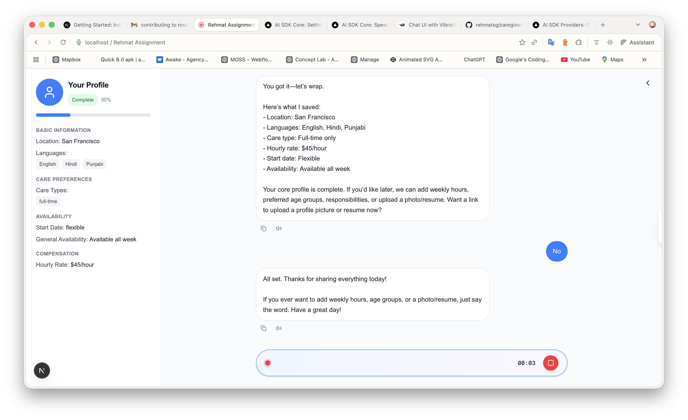

# Caregiver Onboarding Agent

An intelligent caregiver profile management system that uses conversational AI to create and manage caregiver profiles. Features voice input, real-time transcription, and text-to-speech capabilities.

## Features

- Natural conversational interface using GPT-5 to collect caregiver information
- Record audio responses that are automatically transcribed using OpenAI Whisper
- Listen to AI responses with integrated TTS playback
- View, edit, and delete caregiver profiles
- SQLite-based data storage with Drizzle ORM
- Responsive design with Tailwind CSS
- Test suite with Vitest

## Tech Stack

- **Frontend:** Next.js (App Router), React, TypeScript, Tailwind CSS
- **AI:** OpenAI (GPT-5 for chat + tools, Whisper for STT, TTS for playback), via Vercel AI SDK
- **Data layer:** SQLite + Drizzle ORM
- **Runtime:** Node.js
- **Testing:** Vitest

## Prerequisites

- Node.js 20+ (LTS recommended)
- npm or yarn package manager
- OpenAI API key

## Quick Setup

1. **Clone the repository and install dependencies:**

```bash
npm install
```

2. **Set up environment variables:**

Create a `.env.local` file in the root directory:

```bash
OPENAI_API_KEY=your_openai_api_key_here
```

3. **Initialize the database:**

The database will be automatically created when you run the development server. Optionally, you can use Drizzle commands:

```bash
# Generate migrations
npm run db:generate

# Push schema to database
npm run db:push

# Open Drizzle Studio (database GUI)
npm run db:studio
```

4. **Start the development server:**

```bash
npm run dev
```

5. **Open your browser:**

Navigate to [http://localhost:3000](http://localhost:3000)

## AI Usage Disclosure

- ChatGPT (GPT-5) used to generate this README file
- System prompt generation for the agent based on the instructions in the email
- Cursor (Sonnet 4.5) used to generate unit tests for database-related functions
- Cursor used to generate the UI for speech-to-text bubble
- Cursor Agent to clean up Tailwind classes and minor code improvements

## AI Models Used

| Task              | Model     | Purpose                                     |
| ----------------- | --------- | ------------------------------------------- |
| Chat + tool calls | GPT-5     | Conversational logic and structured updates |
| Speech-to-text    | whisper-1 | Real-time transcription of voice input      |
| Text-to-speech    | tts-1     | Playback of assistant messages              |

The Vercel AI SDK handles all AI interactions — chat, transcription, and text-to-speech — making it easy to swap or upgrade models without changing the app’s logic.

## Demo

[Watch the demo video](./public/demo-video.mov)

### Conversational Profile Setup



### Profile Summary and Completion



### Voice Input Recording


